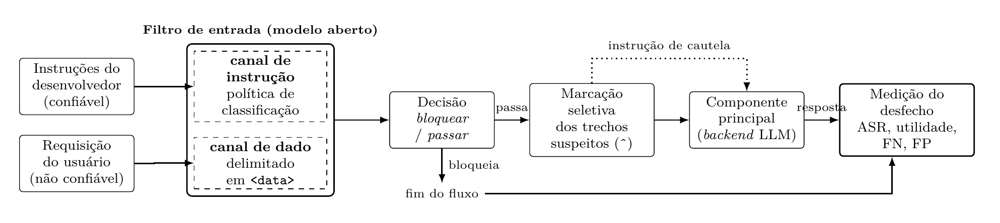

# TG: separação de canal em *guardrails* de entrada

Trabalho de Graduação (ITA) sobre segurança de sistemas baseados em LLM. Ele
mede o ganho, na saída do sistema, de separar o canal de instrução do canal de
dado em um *guardrail* de entrada, usando modelos abertos.

O filtro que protege o componente principal contra instruções embutidas em
dados é, ele próprio, uma LLM que recebe instrução e dado pelo mesmo canal, e
por isso herda a vulnerabilidade que deveria mitigar. O trabalho testa duas
intervenções no filtro:

1. **Delimitação:** o conteúdo não confiável chega ao filtro dentro de
   `<data>...</data>`, com a instrução fora de qualquer tag.
2. **Marcação seletiva:** ao liberar a requisição, o filtro marca com `^` os
   trechos que julgou suspeitos. O componente principal recebe o texto inteiro,
   anotado, e um aviso para tratar os trechos marcados como dado de risco.

Diferente das defesas publicadas, que **removem** o trecho suspeito, a marcação
preserva o texto e deixa a ponderação para o componente principal.

## Fluxo



1. As instruções do desenvolvedor (confiáveis) e a requisição do usuário (não
   confiável) chegam ao **filtro de entrada** por canais separados.
2. O filtro decide entre **bloquear** e **passar**. Se bloqueia, o fluxo termina.
3. Se passa, os trechos suspeitos são marcados e o conteúdo segue ao
   **componente principal** (*backend* LLM).
4. O resultado é medido **na resposta do componente principal**: um ataque que
   atravessa o filtro mas não é executado não conta como sucesso.

## Desenho experimental

As duas intervenções formam um desenho 2×2, mais uma referência sem filtro:

|                     | sem marcação | com marcação seletiva  |
|---------------------|--------------|------------------------|
| **sem delimitação** | `simple`     | `demarking`            |
| **com delimitação** | `delimiting` | `delimiting_demarking` |

Cada condição roda com dois modelos abertos (`llama-3.1-8b` e `gpt-oss-20b`),
que fazem tanto o papel de filtro quanto o de componente principal, e com o
`gpt-oss-safeguard` como filtro fine-tunado de referência. A bateria é repetida
dez vezes sobre três benchmarks públicos de *prompt injection*. As medidas
principais são a taxa de sucesso do ataque (ASR), a utilidade e o
sobre-bloqueio.

## Estrutura

```
experiments/        código do experimento
  src/              pipeline, condições, chamadas à API, métricas e análise
  notebooks/        notebook que percorre o fluxo passo a passo
  run_parallel.py   roda a bateria completa, com retomada
  buildAnalysis.py  consolida os resultados em CSV e tabelas LaTeX
  makeFigures.py    desenha as figuras a partir dos CSV
latex/              texto do TG (TG3.tex) e versão sem apêndices (TG_preliminar.tex)
```

As pastas `data/` (benchmarks) e `results/` (registros da execução) são
geradas localmente e não fazem parte do repositório.

## Como usar

### 1. Instalar

```bash
cd experiments
pip install -r requirements.txt
cp env.example.yaml env.yaml
```

### 2. Configurar a chave da API

Os modelos são chamados pelo [OpenRouter](https://openrouter.ai/keys). Coloque
a chave no campo `apiKey` do `experiments/env.yaml` (que não é versionado) ou
na variável de ambiente `OPENROUTER_API_KEY`.

### 3. Baixar os benchmarks

Na raiz do repositório:

```bash
git clone https://github.com/microsoft/BIPIA data/raw/BIPIA
git clone https://github.com/egozverev/Should-It-Be-Executed-Or-Processed data/raw/SEP
```

O terceiro benchmark (NotInject) é baixado automaticamente do HuggingFace.

### 4. Rodar o experimento

> Toda execução chama a API e consome crédito; não há modo de teste. A bateria
> completa custa cerca de US$ 14 (US$ 1,40 por repetição).

```bash
cd experiments
python run_parallel.py --dry-run   # mostra o estado de cada repetição
python run_parallel.py             # roda o que falta
```

A execução é retomável: se for interrompida, basta rodar o mesmo comando, e
nada que já foi pago é refeito. Ao terminar, ela gera a análise, as tabelas e
as figuras sozinha. Para regerá-las depois, sem custo:

```bash
python buildAnalysis.py   # results/analysis/*.csv e latex/tables/*.tex
python makeFigures.py     # results/figures/ e latex/figs/
```

### 5. Compilar o documento

Requer uma distribuição TeX (MiKTeX ou TeX Live) e, para o `latexmk`, Perl
(o Git Bash já traz).

```bash
cd latex
latexmk TG3             # documento completo
latexmk TG_preliminar   # até as referências, sem apêndices
```
